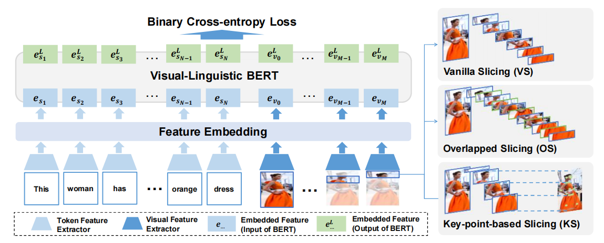

# T-MRS

This repository is official implementation of the paper 
[Transformer based Language-Person Search with Multiple Region Slicing](https://ieeexplore.ieee.org/document/9406055).

Note: This is a preview version of the method. The dataset, settings and pre-trained model will be uploaded soon.

## Introduction

Language-person search is an essential technique for applications like criminal searching, where it is more feasible for a witness to provide language descriptions of a suspect than providing a photo. Most existing works treat the language-person pair as a black-box, neither considering the inner structure in a person picture, nor the correlations between image regions and referring words.
In this work, we propose a transformer-based language-person search framework with matching conducted between words and image regions, where a person picture is vertically separated into multiple regions using two different ways, including the overlapped slicing and the key-point-based slicing.
The co-attention between linguistic referring words and visual features are evaluated via transformer blocks. Besides the obtained outstanding searching performance, the proposed method enables to provide interpretability by visualizing the co-attention between image parts in the person picture and the corresponding referring words. 
Without bells and whistles, we achieve the state-of-the-art performance on the CUHK-PEDES dataset with Rank-1 score of 57.67\% and the PA100K dataset with mAP of 22.88\%, with simple yet elegant design. Code is available on https://github.com/detectiveli/T-MRS.




## Citing V-MRS
```bibtex
@article{article,
author = {Li, Hui and Xiao, Jimin and Sun, Mingjie and Lim, Eng and Zhao, Yao},
year = {2021},
month = {04},
pages = {},
title = {Transformer based Language-Person Search with Multiple Region Slicing},
journal = {IEEE Transactions on Circuits and Systems for Video Technology},
doi = {10.1109/TCSVT.2021.3073718}
}
```

## Prepare

### Environment
I tested the environment on different devices, the settings might be a little different. For more details or bugs, you could reference :
[VL-BERT](https://github.com/jackroos/VL-BERT)

* Ubuntu 16.04, CUDA 9.0
* Python 3.6.x
    ```bash
    # We recommend you to use Anaconda/Miniconda to create a conda environment
    conda create -n vl-bert python=3.6 pip
    conda activate vl-bert
    ```
* PyTorch 1.0.0 or 1.1.0
    ```bash
    conda install pytorch=1.1.0 cudatoolkit=9.0 -c pytorch
    ```
* Apex (optional, for speed-up and fp16 training)
    ```bash
    git clone https://github.com/jackroos/apex
    cd ./apex
    pip install -v --no-cache-dir --global-option="--cpp_ext" --global-option="--cuda_ext" ./  
    ```
* Other requirements:
    ```bash
    cd ./T-MRS/model #update 0813
    pip install -r requirements.txt
    ```
* Compile
    ```bash
    ./scripts/init.sh
    ```

### Data
For CUHK-PEDES
https://pan.baidu.com/s/1sOYAbETwHGAMe5yfx60q0Q key: 8kk1

For PA100K
https://pan.baidu.com/s/1K5p0xlvljBvKIhc3whrMTg key: 54q3

### Pre-trained Models
Pre-trained Models for VL-BERT
Download the pretrained of VL-BERT and put it under the ./T-MRS/pretrained_model
See [PREPARE_PRETRAINED_MODELS.md](https://github.com/jackroos/VL-BERT/blob/master/model/pretrained_model/PREPARE_PRETRAINED_MODELS.md). #update 0813

or from:
https://pan.baidu.com/s/1jLqIIl9UAz-uKRmm2YLLnw key: r97u

Pre-trained models for T-MRS (OS_small_11.model)
https://pan.baidu.com/s/1yw0n31_gwszB-rRdU0QuyQ key: 7d58

## Training

### Non-Distributed Training
```
cd pedes #update 0813
python train_end2end.py --cfg ../cfgs/pedes/OS_small_11.yaml --model-dir ./
```

## Evaluation

### Evaluation:
  ```
  python test.py --split test --cfg ../cfgs/pedes/OS_small_11.yaml --ckpt [your directory]/OS_small_11.model --result-path ./
  ```

## Acknowledgements

Many thanks to following codes that help us a lot in building this codebase:
* [VL-BERT](https://github.com/jackroos/VL-BERT) 
